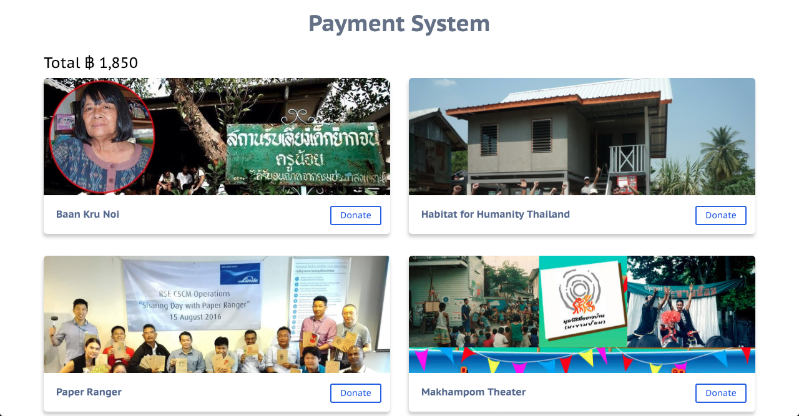
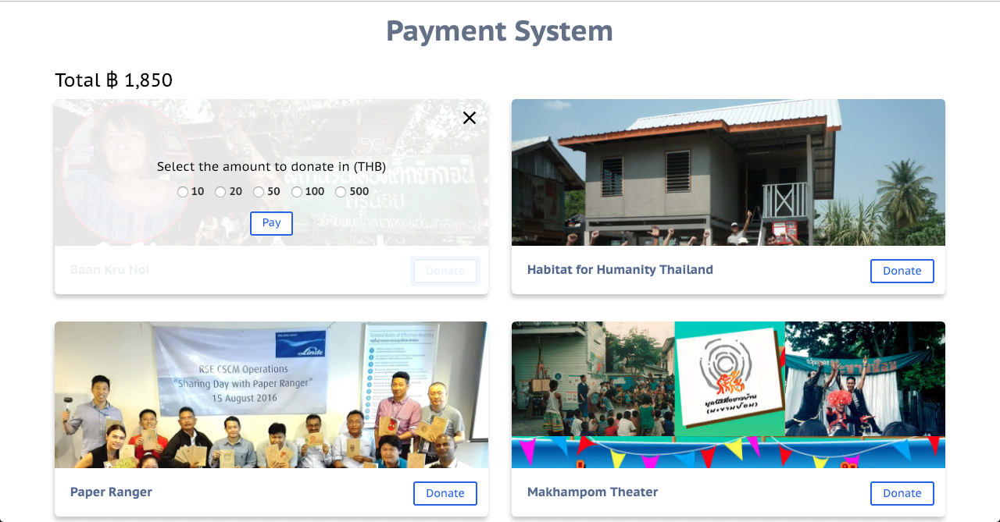
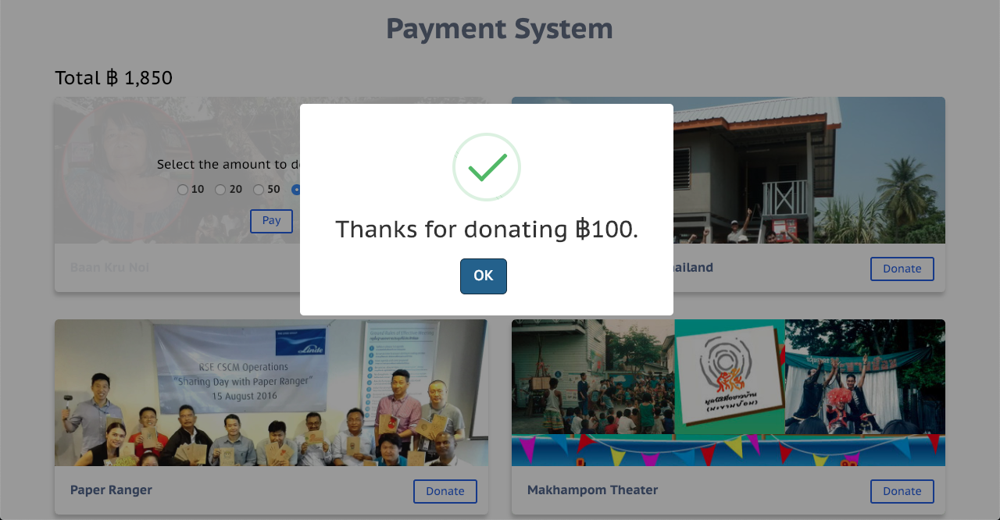

# Setup
Update for new enhancements 

Run,

    // add new packages
    $ npm install

    // run the client
    $ npm run client

    // run the db
    $ npm run server
    

# Redux Test

Added Screenshots for reference 

